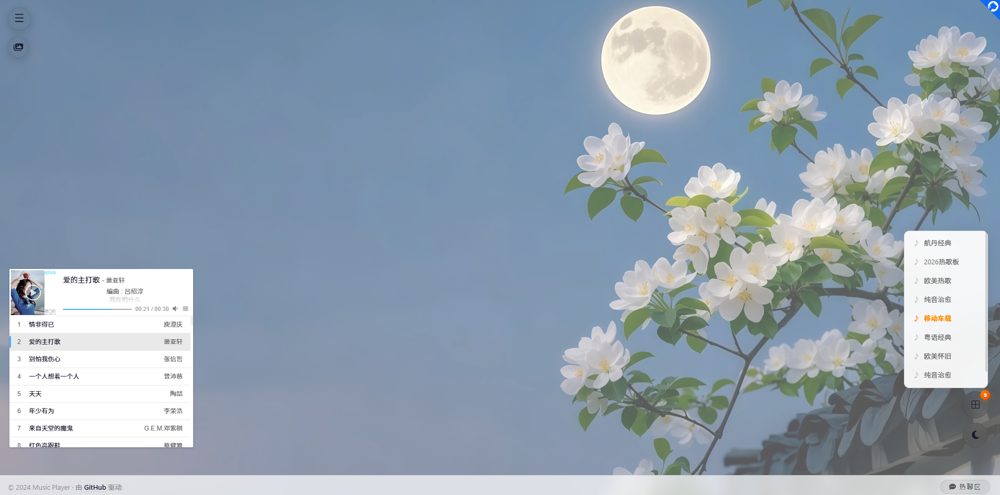

# 🎵 Music Player

一个基于 Vue 3 + Vite + APlayer 的现代音乐播放器，支持多歌单、歌词同步、主题切换、热聊区评论等功能。




---

## ✨ 功能特性

### 🎵 核心播放
| 功能 | 说明 |
|------|------|
| 音乐播放 | 基于 APlayer 引擎，支持网易云歌单 |
| 歌单切换 | 下拉菜单快速切换歌单，自动加载歌曲 |
| 歌词同步 | 滚动歌词显示，打字机动画效果 |
| 播放控制 | 播放/暂停、上一首/下一首、音量调节 |
| 循环模式 | 循环全部、单曲循环、顺序播放 |

### 🎨 界面交互
| 功能 | 说明 |
|------|------|
| 歌词窗口 | 可拖动、可缩放、可调节颜色和字号 |
| 音乐胶囊 | 点击展开/收起播放器，播放时旋转动画 |
| 主题切换 | 亮色/暗色模式，自动记忆偏好 |
| 右键菜单 | 完整的播放控制菜单，Font Awesome 6 图标 |
| 键盘快捷键 | 空格播放/暂停，←/→ 切歌 |

### 📺 视频扩展
| 功能 | 说明 |
|------|------|
| 在线视频 | 支持 MP4 直链播放 |
| YouTube | 支持 YouTube 链接嵌入播放 |
| Bilibili | 支持 Bilibili 视频/番剧/EP 嵌入播放 |

### 💬 社交功能
| 功能 | 说明 |
|------|------|
| 热聊区 | 基于 Twikoo 的评论系统 |
| 话题标签 | 点击自动填入预设话题，方便讨论 |

---

## 📁 项目结构

```
music-player/
├── .github/
│   └── workflows/
│       └── deploy.yml        # GitHub Actions 自动部署
├── public/
│   └── favicon.ico           # 网站图标
├── src/
│   ├── main.js               # 应用入口
│   ├── App.vue               # 根组件（含全局样式）
│   ├── config/
│   │   ├── index.js          # API 配置、歌词配置
│   │   └── videos.js         # 视频数据配置
│   ├── stores/
│   │   └── playerStore.js    # Pinia 状态管理
│   ├── components/
│   │   ├── Capsule.vue       # 音乐胶囊
│   │   ├── Player.vue        # 播放器
│   │   ├── Lyrics.vue        # 歌词窗口
│   │   ├── Playlist.vue      # 歌单切换
│   │   ├── ThemeToggle.vue   # 主题切换
│   │   ├── RightMenu.vue     # 右键菜单
│   │   ├── Chat.vue          # 热聊区
│   │   ├── NavMenu.vue       # 左上角导航菜单
│   │   ├── VideoPlayer.vue   # 通用视频播放器
│   │   ├── VideoPage.vue     # 在线视频
│   │   ├── YouTubePage.vue   # YouTube 视频
│   │   ├── BilibiliPage.vue  # Bilibili 视频
│   │   └── LinksPage.vue     # 影音友链
│   └── styles/
│       └── base.css          # 基础样式
├── index.html                # 入口 HTML
├── package.json              # 项目依赖
├── vite.config.js            # Vite 配置
└── README.md
```

---

## 🔧 配置说明

### 1. 歌单配置

**文件位置：** `src/stores/playerStore.js`

```javascript
const playlists = ref([
  { id: '14148542684', name: '华语流行' },
  { id: '3779629', name: '粤语经典' },
  // 想加多少加多少
]);
```

**获取歌单 ID：**
```
https://music.163.com/playlist?id=14148542684
                              ↑ 这就是 ID
```

### 2. API 配置

**文件位置：** `src/config/index.js`

```javascript
export const API_CONFIG = {
    METING_API: 'https://api.injahow.cn/meting/',
    LRC_API: 'https://api.uomg.com/api/163/lyric',
    TWIKOO_ENV_ID: 'https://twikoo.hangdn.com',
    TWIKOO_REGION: 'ap-guangzhou'
};
```

### 3. 歌词配置

```javascript
export const LYRICS_CONFIG = {
    updateInterval: 200,      // 歌词轮询间隔 (ms)
    minWidth: 150,
    minHeight: 70,
    defaultColor: '#ff4500',
    defaultFontSize: 30
};
```

### 4. 视频配置

**文件位置：** `src/config/videos.js`

```javascript
// 普通视频（MP4 直链）
export const VIDEO_ITEMS = [
  { id: 1, title: '视频 1', url: 'https://example.com/video.mp4', group: '默认' },
];

// YouTube 视频
export const YOUTUBE_ITEMS = [
  { id: 1, title: '示例视频', url: 'https://www.youtube.com/watch?v=xxx', group: '默认' },
];

// Bilibili 视频（支持 BV / SS / EP）
export const BILIBILI_ITEMS = [
  { id: 1, title: 'B站视频', url: 'https://www.bilibili.com/video/BVxxxxxxx', group: '默认' },
];
```

### 5. Twikoo 评论配置

**文件位置：** `src/components/Chat.vue`

```javascript
twikooInstance = twikoo.init({
    el: containerRef.value,
    envId: 'https://你的-twikoo-地址.com',  // 改这里
    region: 'ap-guangzhou'
})
```

---

## 🚀 部署

### GitHub Pages（推荐）

项目已配置 GitHub Actions 自动部署：

1. Fork 本仓库
2. 修改配置
3. 推送代码到 `main` 分支
4. Actions 自动构建并推送到 `gh-pages` 分支
5. 访问 `https://你的用户名.github.io/musicplayer/`

### 本地开发

```bash
# 安装依赖
npm install

# 启动开发服务器 (http://localhost:3000)
npm run dev

# 构建生产版本
npm run build

# 预览生产版本
npm run preview
```

### Cloudflare Pages 部署

1. 构建项目：`npm run build`
2. 在 Cloudflare Pages 中新建项目
3. 上传 `dist` 目录
4. 部署完成

---

## 🎮 使用指南

### 播放控制

| 操作 | 说明 |
|------|------|
| 点击音乐胶囊 | 展开/收起播放器 |
| 点击播放器控制按钮 | 播放/暂停/切歌 |
| 右键页面空白处 | 呼出控制菜单 |
| 空格键 | 播放/暂停 |
| ← 方向键 | 上一首 |
| → 方向键 | 下一首 |
| ESC 键 | 关闭热聊区弹窗 |

### 歌词窗口

| 操作 | 说明 |
|------|------|
| 拖拽窗口中间 | 移动位置 |
| 拖拽右下角手柄 | 缩放窗口大小 |
| 悬停右上角齿轮 | 点击调出设置面板 |
| 设置面板 | 调节文字颜色和字号 |
| 重置按钮 | 恢复默认位置和样式 |

### 导航菜单

| 操作 | 说明 |
|------|------|
| 点击左上角 ☰ | 展开导航菜单 |
| 在线视频 | MP4 直链视频播放 |
| YouTube | YouTube 嵌入播放 |
| Bilibili | Bilibili 视频/番剧播放 |
| 影音友链 | 友情链接集合 |

---

## 🛠️ 技术栈

| 技术 | 用途 |
|------|------|
| Vue 3 | 前端框架 |
| Pinia | 状态管理 |
| Vite | 构建工具 |
| APlayer | 音乐播放引擎 |
| Font Awesome 6 | 图标库 |
| Twikoo | 评论系统 |

---

## 📝 更新日志

### v1.1.0 (2026-07)
- ✅ 新增左上角导航菜单
- ✅ 新增在线视频播放页面
- ✅ 新增 YouTube 嵌入播放
- ✅ 新增 Bilibili 视频/番剧播放
- ✅ 新增影音友链页面
- ✅ 统一视频播放器组件
- ✅ 背景图自动换新 + 毛玻璃效果
- ✅ Font Awesome 6 图标全面替换

### v1.0.0 (2024-07)
- ✅ 基础播放功能
- ✅ 歌单切换
- ✅ 歌词同步显示
- ✅ 歌词窗口拖动/缩放
- ✅ 亮色/暗色主题
- ✅ 热聊区评论
- ✅ 移动端适配
- ✅ 键盘快捷键
- ✅ 右键菜单
- ✅ 循环模式切换
- ✅ 音量记忆
- ✅ 打字机歌词动画

---

## 📄 许可证

MIT License

