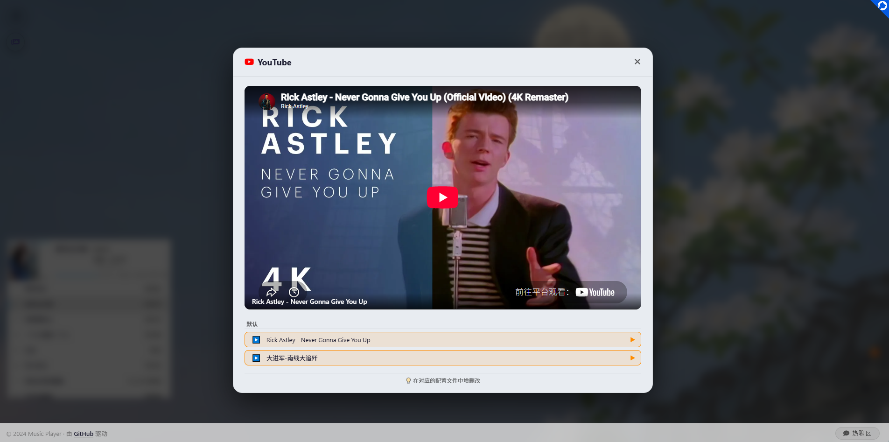

<div align="center">
  
  
  # 🎵 Music Player
  
  **一个基于 Vue 3 + Vite 的现代音乐播放器**
  
  [](https://vuejs.org/)
  [](https://vitejs.dev/)
  [](https://pinia.vuejs.org/)
  [](LICENSE)
  
  <p>
    <a href="#-在线演示">在线演示</a> •
    <a href="#-功能特性">功能特性</a> •
    <a href="#-快速开始">快速开始</a> •
    <a href="#-配置说明">配置说明</a> •
    <a href="#-API-接口">API 接口</a> •
    <a href="#-项目结构">项目结构</a>
  </p>

  
  
</div>

---

## 🌐 在线演示

[https://chnbsdan.github.io/musicplayer/](https://chnbsdan.github.io/musicplayer/)

---

## ✨ 功能特性

### 🎵 核心播放
| 功能 | 说明 |
|------|------|
| 音乐播放 | 基于 APlayer 引擎，支持网易云歌单 |
| 歌单切换 | 下拉菜单快速切换，自动加载歌曲 |
| 歌词同步 | 滚动歌词 + 打字机动画效果 |
| 播放控制 | 播放/暂停、上一首/下一首、音量调节 |
| 循环模式 | 循环全部、单曲循环、顺序播放 |

### 🎨 界面交互
| 功能 | 说明 |
|------|------|
| 歌词窗口 | 可拖动、可缩放、可调节颜色和字号 |
| 音乐胶囊 | 点击展开/收起播放器，播放时旋转动画 |
| 主题切换 | 亮色/暗色模式，自动记忆偏好 |
| 右键菜单 | Font Awesome 6 图标，完整控制 |
| 键盘快捷键 | 空格播放/暂停，←/→ 切歌，ESC 关闭弹窗 |

### 📺 视频扩展
| 功能 | 说明 |
|------|------|
| 在线视频 | 支持 MP4 直链播放，卡片式列表 |
| YouTube | 支持 YouTube 链接嵌入播放 |
| Bilibili | 支持 Bilibili 视频/番剧/EP 嵌入播放 |

### 🎶 音乐搜索与下载
| 功能 | 说明 |
|------|------|
| 音乐搜索 | 基于 Meting API 搜索歌曲 |
| 音乐下载 | 基于 GD Studio API 搜索/试听/下载（320k/128k） |
| 多音源 | 支持网易云、QQ音乐、酷狗等 |

### 💬 社交功能
| 功能 | 说明 |
|------|------|
| 热聊区 | 基于 Twikoo 的评论系统 |
| 话题标签 | 点击自动填入预设话题 |

---

## 🚀 快速开始

### 本地开发

```bash
# 克隆项目
git clone https://github.com/chnbsdan/musicplayer.git
cd musicplayer

# 安装依赖
npm install

# 启动开发服务器 (http://localhost:3000)
npm run dev

# 构建生产版本
npm run build

# 预览生产版本
npm run preview
```

### GitHub Pages 部署

项目已配置 GitHub Actions 自动部署：

1. Fork 本仓库
2. 修改配置
3. 推送代码到 `main` 分支
4. Actions 自动构建并推送到 `gh-pages` 分支
5. 访问 `https://你的用户名.github.io/musicplayer/`

---

## 🔧 配置说明

### 1. 歌单配置

**文件位置：** `src/stores/playerStore.js`

```javascript
const playlists = ref([
  { id: '14148542684', name: '华语流行' },
  { id: '3779629', name: '粤语经典' },
  // 想加多少加多少
]);
```

**获取歌单 ID：**
```
https://music.163.com/playlist?id=14148542684
                              ↑ 这就是 ID
```

### 2. API 配置

**文件位置：** `src/config/index.js`

```javascript
export const API_CONFIG = {
    METING_API: 'https://api.injahow.cn/meting/',
    LRC_API: 'https://api.uomg.com/api/163/lyric',
    TWIKOO_ENV_ID: 'https://twikoo.hangdn.com',
    TWIKOO_REGION: 'ap-guangzhou'
};
```

### 3. 视频配置

**文件位置：** `src/config/videos.js`

```javascript
// 普通视频（MP4 直链）
export const VIDEO_ITEMS = [
  { id: 1, title: '视频 1', url: 'https://example.com/video.mp4', group: '默认' },
];

// YouTube 视频
export const YOUTUBE_ITEMS = [
  { id: 1, title: '示例视频', url: 'https://www.youtube.com/watch?v=xxx', group: '默认' },
];

// Bilibili 视频
export const BILIBILI_ITEMS = [
  { id: 1, title: 'B站视频', url: 'https://www.bilibili.com/video/BVxxxxxxx', group: '默认' },
];
```

---

## 📡 API 接口

### 一、音乐搜索 API（Meting 接口）

项目使用 `https://api.i-meto.com/meting/demo` 作为音乐搜索的前端展示接口。

**基础地址：**
```
https://api.i-meto.com/meting/demo
```

#### 搜索歌曲（页面展示）

```
GET /demo?id={关键词}
```

| 参数 | 类型 | 必填 | 说明 |
|------|------|------|------|
| `id` | string | ✅ | 搜索关键词（歌手名/歌曲名） |

**请求示例：**
```
https://api.i-meto.com/meting/demo?id=王杰
```

**返回：** 一个包含歌曲列表的 HTML 播放器页面，可直接在 iframe 中展示。

---

### 二、音乐下载 API（GD Studio 接口）

项目使用 [GD Studio API](https://music.gdstudio.xyz) 作为音乐下载的后端。

**基础地址：**
```
https://music-api.gdstudio.xyz/api.php
```

#### 1. 搜索歌曲

```
GET /api.php?types=search&source=netease&name={关键词}&count={数量}
```

| 参数 | 类型 | 必填 | 说明 |
|------|------|------|------|
| `types` | string | ✅ | 固定为 `search` |
| `source` | string | ❌ | 音乐源：netease/tencent/kuwo，默认 netease |
| `name` | string | ✅ | 搜索关键词 |
| `count` | string | ❌ | 返回数量，默认 20 |

**请求示例：**
```
https://music-api.gdstudio.xyz/api.php?types=search&source=netease&name=周杰伦&count=10
```

**返回示例：**
```json
[
  {
    "id": "5257138",
    "name": "屋顶",
    "artist": ["周杰伦", "温岚"],
    "album": "男女情歌对唱冠军全记录",
    "pic_id": "109951165671182684",
    "source": "netease"
  }
]
```

#### 2. 获取播放链接（试听/下载）

```
GET /api.php?types=url&source={音源}&id={歌曲ID}&br={音质}
```

| 参数 | 类型 | 必填 | 说明 |
|------|------|------|------|
| `types` | string | ✅ | 固定为 `url` |
| `source` | string | ❌ | 音乐源，默认 netease |
| `id` | string | ✅ | 歌曲 ID |
| `br` | string | ❌ | 音质：128/192/320/740/999，默认 999 |

**请求示例：**
```
https://music-api.gdstudio.xyz/api.php?types=url&source=netease&id=5257138&br=128
```

**返回示例：**
```json
{
  "url": "https://m701.music.126.net/.../song.mp3",
  "br": 128,
  "size": 5105833
}
```

#### 3. 获取专辑封面

```
GET /api.php?types=pic&source={音源}&id={图片ID}&size={尺寸}
```

| 参数 | 类型 | 必填 | 说明 |
|------|------|------|------|
| `types` | string | ✅ | 固定为 `pic` |
| `source` | string | ❌ | 音乐源，默认 netease |
| `id` | string | ✅ | 图片 ID（从搜索结果的 `pic_id` 获取） |
| `size` | string | ❌ | 图片尺寸：300/500，默认 300 |

**请求示例：**
```
https://music-api.gdstudio.xyz/api.php?types=pic&source=netease&id=109951165671182684&size=500
```

#### 4. 获取歌词

```
GET /api.php?types=lyric&source={音源}&id={歌词ID}
```

| 参数 | 类型 | 必填 | 说明 |
|------|------|------|------|
| `types` | string | ✅ | 固定为 `lyric` |
| `source` | string | ❌ | 音乐源，默认 netease |
| `id` | string | ✅ | 歌词 ID（通常与歌曲 ID 相同） |

**请求示例：**
```
https://music-api.gdstudio.xyz/api.php?types=lyric&source=netease&id=5257138
```

---

### 支持的音源

| 音源 | `source` 参数 | 状态 |
|------|--------------|------|
| 网易云音乐 | `netease` | ✅ 稳定 |
| QQ音乐 | `tencent` | ✅ 稳定 |
| 酷狗音乐 | `kugou` | ✅ 稳定 |
| 酷我音乐 | `kuwo` | ✅ 稳定 |
| Tidal | `tidal` | ⚠️ 部分可用 |
| YouTube Music | `ytmusic` | ⚠️ 部分可用 |

---

### 前端使用示例

```javascript
// ===== Meting 搜索（页面展示） =====
const searchMeting = (keyword) => {
  const iframe = document.getElementById('musicFrame');
  iframe.src = `https://api.i-meto.com/meting/demo?id=${encodeURIComponent(keyword)}`;
};

// ===== GD Studio 搜索（获取数据） =====
const searchMusic = async (keyword) => {
  const res = await fetch(
    `https://music-api.gdstudio.xyz/api.php?types=search&source=netease&name=${encodeURIComponent(keyword)}`
  );
  return await res.json();
};

// ===== GD Studio 获取播放链接 =====
const getSongUrl = async (songId, br = 128) => {
  const res = await fetch(
    `https://music-api.gdstudio.xyz/api.php?types=url&source=netease&id=${songId}&br=${br}`
  );
  const data = await res.json();
  return data.url;
};

// ===== 下载歌曲 =====
const downloadSong = async (songId, title, artist) => {
  const url = await getSongUrl(songId);
  if (url) {
    const a = document.createElement('a');
    a.href = url;
    a.download = `${title}-${artist}.mp3`;
    a.click();
  }
};
```

---

## 📁 项目结构

```
music-player/
├── .github/
│   └── workflows/
│       └── deploy.yml        # GitHub Actions 自动部署
├── public/
│   └── favicon.ico           # 网站图标
├── src/
│   ├── main.js               # 应用入口
│   ├── App.vue               # 根组件（含全局样式）
│   ├── config/
│   │   ├── index.js          # API 配置
│   │   └── videos.js         # 视频数据配置
│   ├── stores/
│   │   └── playerStore.js    # Pinia 状态管理（歌单在这里）
│   ├── components/
│   │   ├── Capsule.vue       # 音乐胶囊
│   │   ├── Player.vue        # 播放器
│   │   ├── Lyrics.vue        # 歌词窗口
│   │   ├── Playlist.vue      # 歌单切换
│   │   ├── ThemeToggle.vue   # 主题切换
│   │   ├── RightMenu.vue     # 右键菜单
│   │   ├── Chat.vue          # 热聊区
│   │   ├── NavMenu.vue       # 左上角导航菜单
│   │   ├── VideoPlayer.vue   # 通用视频播放器
│   │   ├── VideoPage.vue     # 在线视频
│   │   ├── YouTubePage.vue   # YouTube 视频
│   │   ├── BilibiliPage.vue  # Bilibili 视频
│   │   ├── LinksPage.vue     # 影音友链
│   │   ├── MusicSearchPage.vue  # 音乐搜索
│   │   └── MusicDownloadPage.vue # 音乐下载
│   └── styles/
│       └── base.css          # 基础样式
├── index.html                # 入口 HTML
├── package.json              # 项目依赖
├── vite.config.js            # Vite 配置
└── README.md
```

---

## 🎮 快捷键

| 快捷键 | 功能 |
|--------|------|
| 空格键 | 播放 / 暂停 |
| ← 方向键 | 上一首 |
| → 方向键 | 下一首 |
| ESC 键 | 关闭热聊区/弹窗 |
| Ctrl+K | 聚焦搜索框 |

---

## 🛠️ 技术栈

| 技术 | 用途 |
|------|------|
| Vue 3 | 前端框架 |
| Pinia | 状态管理 |
| Vite | 构建工具 |
| APlayer | 音乐播放引擎 |
| Font Awesome 6 | 图标库 |
| Twikoo | 评论系统 |
| Meting API | 音乐搜索展示 |
| GD Studio API | 音乐搜索与下载 |

---

## 📝 更新日志

### v1.2.0 (2026-07)
- ✅ 新增音乐搜索功能（Meting API）
- ✅ 新增音乐下载功能（GD Studio API，支持 320k/128k）
- ✅ 统一 Font Awesome 6 图标
- ✅ 导航菜单图标颜色区分
- ✅ 音乐下载页面播放/暂停状态切换
- ✅ 修复弹窗事件冒泡问题

### v1.1.0 (2026-07)
- ✅ 新增左上角导航菜单
- ✅ 新增在线视频播放页面
- ✅ 新增 YouTube 嵌入播放
- ✅ 新增 Bilibili 视频/番剧播放
- ✅ 新增影音友链页面
- ✅ 统一视频播放器组件
- ✅ 背景图自动换新 + 毛玻璃效果

### v1.0.0 (2024-07)
- ✅ 基础播放功能
- ✅ 歌单切换
- ✅ 歌词同步显示
- ✅ 歌词窗口拖动/缩放
- ✅ 亮色/暗色主题
- ✅ 热聊区评论
- ✅ 移动端适配
- ✅ 键盘快捷键
- ✅ 右键菜单
- ✅ 循环模式切换
- ✅ 音量记忆
- ✅ 打字机歌词动画

---

## 📄 许可证

MIT License

---

<div align="center">
  <sub>Built with ❤️ by <a href="https://github.com/chnbsdan">chnbsdan</a></sub>
</div>
